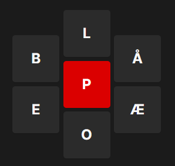

# Word Star Puzzle Solver 🧩

A CLI tool for solving VGs word star puzzle.

## Install ⬇️

### Option 1: With Cargo

Make sure you have rust installed on your pc. Check how to install rust [here](https://www.rust-lang.org/tools/install).

When you have successfuly installed rust you can install the tool by running this:

```sh
cargo install word-star-puzzle-solver
```

### Option 2: From Release

Install the binary file from releases.

Open a terminal where the binary file is installed and run it.

On windows:

```shell
.\word-star-puzzle-solver.exe --version
```

On unix:

```sh
./word-star-solver --version
```

## How-to-use 🔮

Use `--help` for instructions on how to use the tool:

```sh
word-star-puzzle-solver --help
```

### Example



```sh
word-star-puzzle-solver -r P -a B L Å Æ O E P
```

**Note that P is present in both the required character argument and the allowed characters argument.**

Result:

```text
{"LOPP", "POOP", "PELE", "POLE", "OPEL", "PELLE", "POOL", "LOOP", "LOPPE", "LEPE", "POPP", "OPPE", "LEPPE", "PEPP", "PLOPP", "BOPEL", "POPE", "POLO", "POLL", "BEBOP", "EPLE", "LOOPE", "POPPEL", "PELL", "POPPE"}
```
